# Design do Synapse

Identidade visual e protótipo das telas (issue #8). **É uma proposta para o grupo aprovar**: qualquer item pode ser ajustado.

- **[prototipo.html](prototipo.html)**: protótipo completo. Baixe o repositório e abra o arquivo no navegador. Lá a rede neural é interativa (passe o mouse nos neurônios) e o neurônio cresce animado.
- **[imagens/](imagens)**: PNGs exportados do protótipo, para ver direto no GitHub.
- **[simbolo.svg](simbolo.svg)**: símbolo do logo em vetor, para usar como ícone do app e favicon.

## Conceito

Um cérebro à noite: fundo escuro e calmo, com neurônios que brilham como bioluminescência.

- **Escuro por padrão.** Menos estímulo durante o foco, e o brilho se destaca. O tema claro fica para a #37.
- **O brilho é a recompensa.** Só o que está vivo brilha: neurônios formados, sinapses acesas, conquistas. Neurônios podados ficam cinzas e opacos.
- **Celular primeiro.** As telas foram pensadas para 360 px de largura (#35).
- **Forma = tipo, cor = matéria.** A forma do neurônio mostra a duração da sessão (#22); a cor mostra a matéria (#28).

## Telas

| | | | |
|:-:|:-:|:-:|:-:|
| 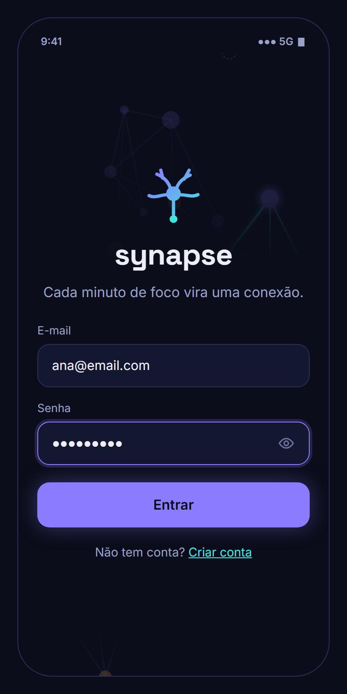 | 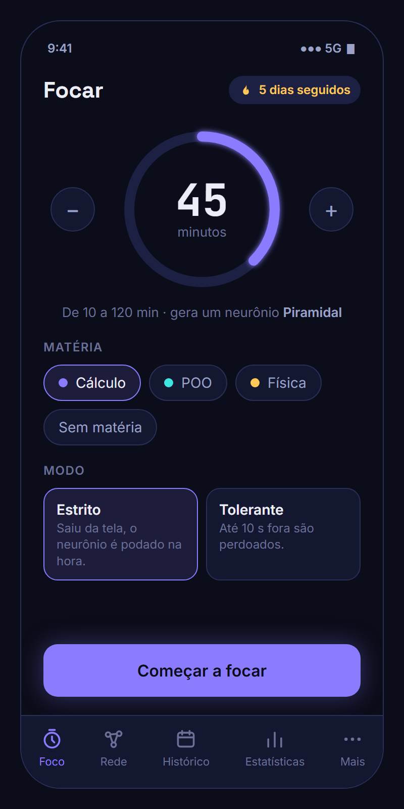 | 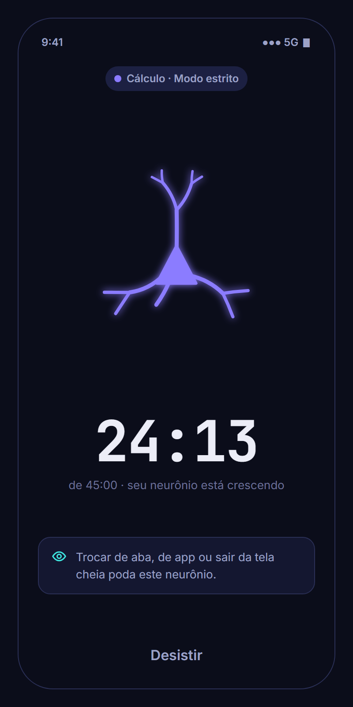 | 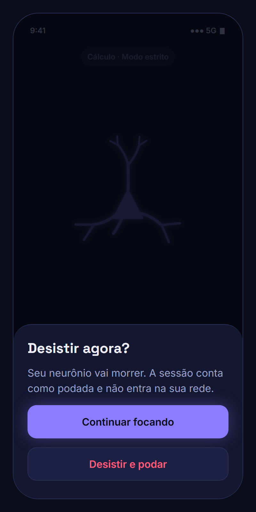 |
| **1. Login** | **2. Foco** | **3. Sessão em andamento** | **4. Desistir** |
| 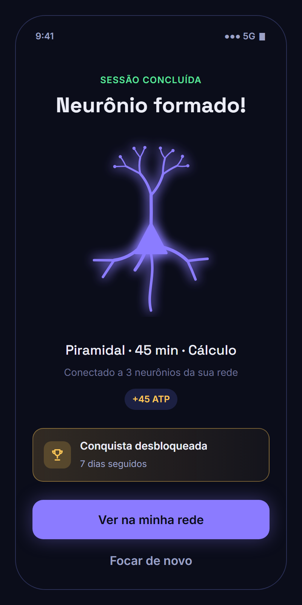 | 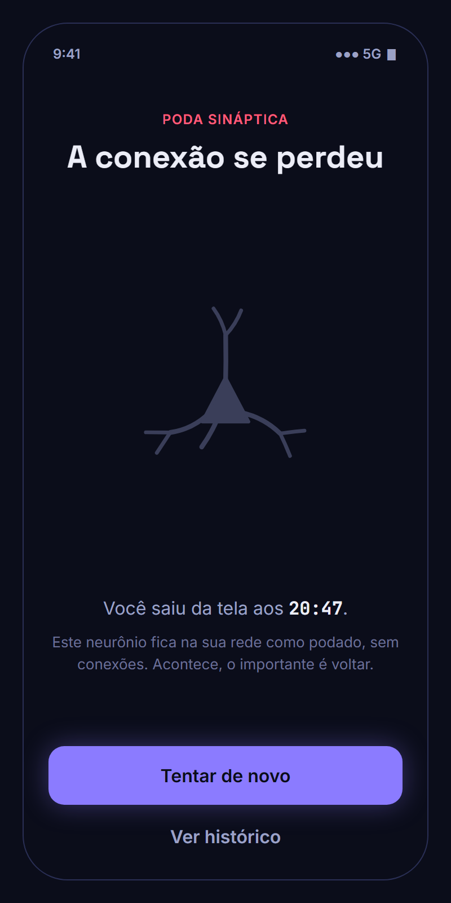 | 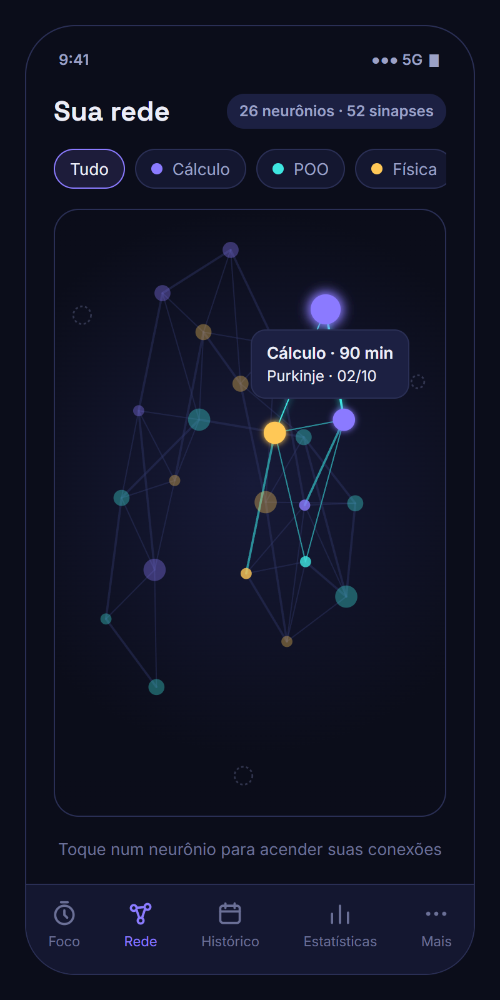 | 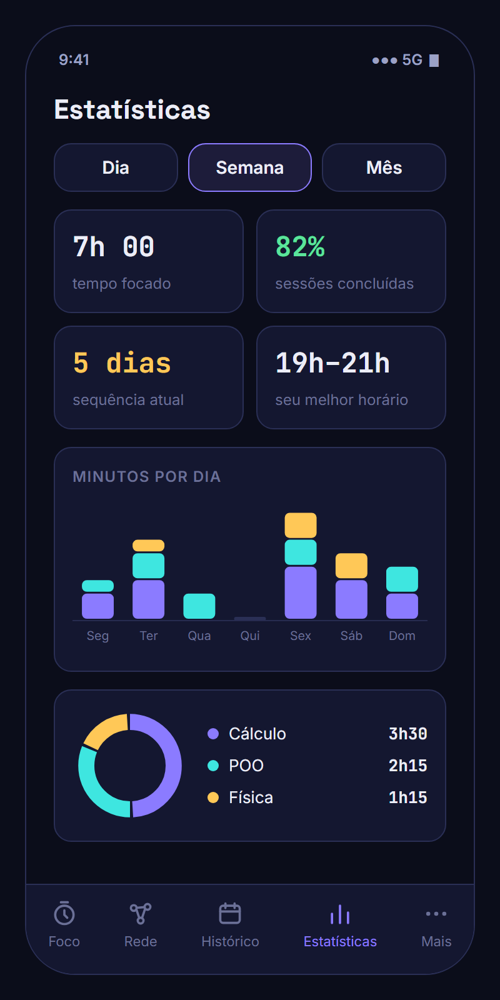 |
| **5. Sucesso** | **6. Poda** | **7. Rede neural** | **8. Estatísticas** |

1. **Login:** a rede ao fundo antecipa a recompensa. O cadastro segue o mesmo visual, com o campo "Nome" a mais.
2. **Foco:** duração, matéria e modo numa tela só, com a sequência de dias sempre visível.
3. **Sessão em andamento:** sem abas e sem distrações. O neurônio cresce junto com o timer.
4. **Desistir:** a ação recomendada (continuar) é o botão de destaque; desistir exige um segundo toque.
5. **Sucesso:** neurônio completo brilhando, ATP ganho e conquista desbloqueada.
6. **Poda:** o mesmo neurônio, retraído e cinza. O tom é de incentivo, não de bronca.
7. **Rede neural:** gerada com a regra da #23 (cada neurônio se liga aos 2 mais recentes e ao último da mesma matéria). Tocar num neurônio acende suas conexões.
8. **Estatísticas:** os números de destaque e os gráficos da #31, nas cores das matérias.

Navegação por abas: **Foco, Rede, Histórico, Estatísticas e Mais** (matérias, conquistas, loja, tema, sair).

## Neurônios

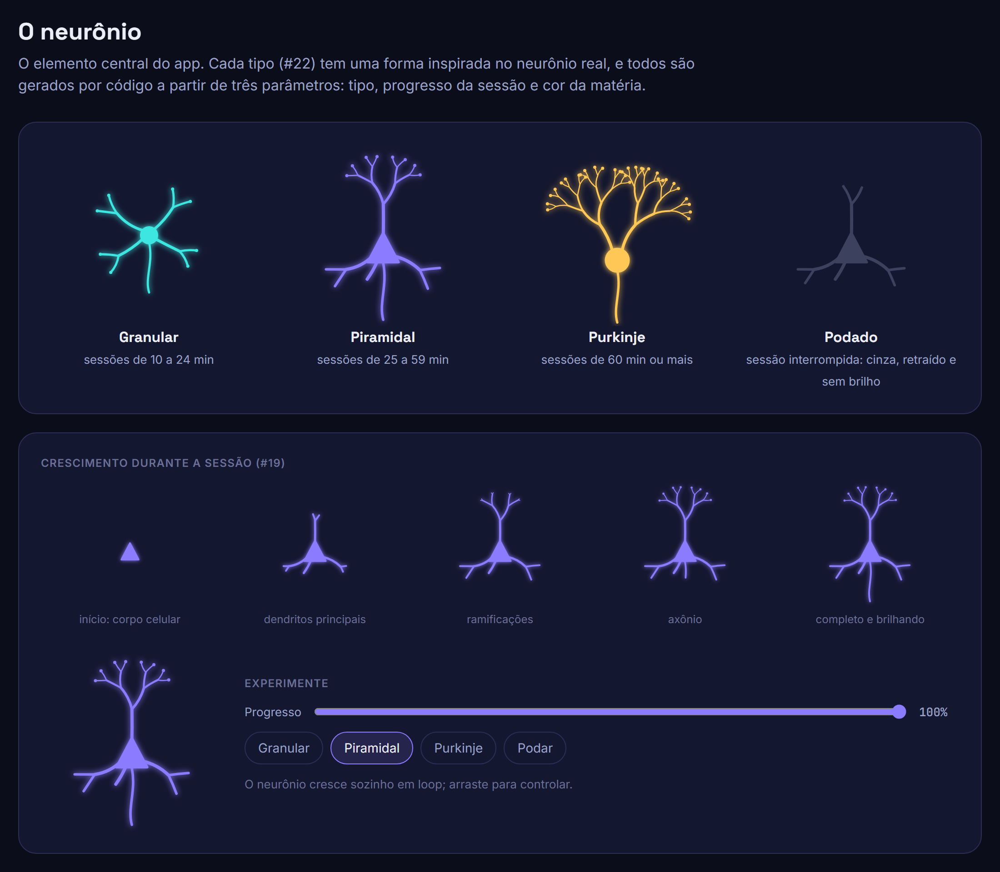

| Tipo | Duração da sessão | Forma |
| ---- | ----------------- | ----- |
| Granular | 10 a 24 min | corpo redondo pequeno, dendritos curtos em estrela |
| Piramidal | 25 a 59 min | corpo triangular, um dendrito longo para cima e outros para os lados |
| Purkinje | 60 min ou mais | corpo grande, árvore de dendritos em leque |
| Podado | sessão interrompida | cinza, retraído (cerca de 40% do tamanho) e sem brilho |

Durante a sessão o neurônio cresce em etapas: corpo celular, dendritos principais, ramificações, axônio e, por fim, o brilho. No protótipo ele é desenhado por código a partir de três parâmetros (tipo, progresso e cor). A mesma ideia pode ser reaproveitada no componente da #19.

## Identidade

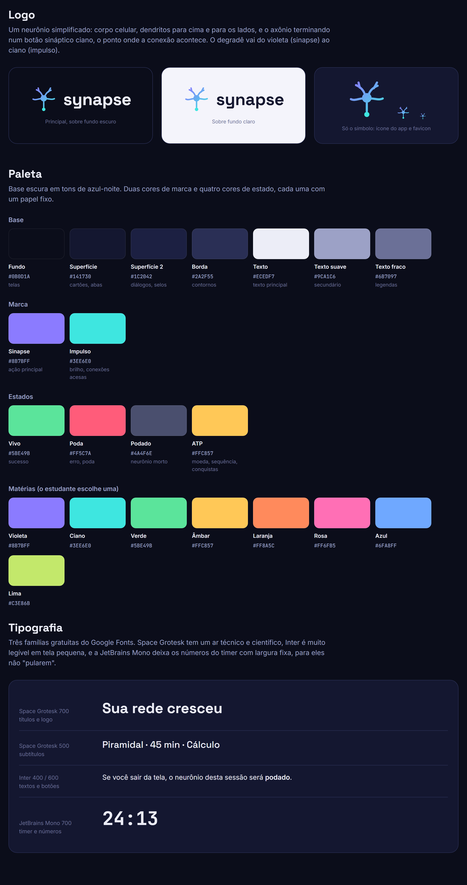

### Logo
Um neurônio simplificado: corpo celular, dendritos e o axônio terminando num botão sináptico ciano, o ponto onde a conexão acontece. O degradê vai do violeta (`#8B7BFF`) ao ciano (`#3EE6E0`). O nome é escrito em minúsculas, em Space Grotesk 700: **synapse**.

### Paleta

| Papel | Nome | Cor | Uso |
| ----- | ---- | --- | --- |
| Base | Fundo | `#0B0D1A` | fundo das telas |
| Base | Superfície | `#141730` | cartões, barra de abas |
| Base | Superfície 2 | `#1C2042` | diálogos, selos |
| Base | Borda | `#2A2F55` | contornos |
| Base | Texto | `#ECEDF7` | texto principal |
| Base | Texto suave | `#9CA1C6` | texto secundário |
| Base | Texto fraco | `#6B7097` | legendas |
| Marca | Sinapse | `#8B7BFF` | ação principal, botões |
| Marca | Impulso | `#3EE6E0` | brilho, conexões acesas |
| Estado | Vivo | `#5BE49B` | sucesso |
| Estado | Poda | `#FF5C7A` | erro, poda |
| Estado | Podado | `#4A4F6E` | neurônio morto |
| Estado | ATP | `#FFC857` | moeda, sequência, conquistas |

**Cores para as matérias** (o estudante escolhe uma ao criar a matéria): violeta `#8B7BFF`, ciano `#3EE6E0`, verde `#5BE49B`, âmbar `#FFC857`, laranja `#FF8A5C`, rosa `#FF6FB5`, azul `#6FA8FF` e lima `#C3E86B`.

### Tipografia

Todas gratuitas, do [Google Fonts](https://fonts.google.com):

| Fonte | Uso |
| ----- | --- |
| **Space Grotesk** 500/700 | títulos, logo, subtítulos |
| **Inter** 400/600 | textos, botões, campos |
| **JetBrains Mono** 500/700 | timer e números (largura fixa, os dígitos não "pulam") |

### Componentes

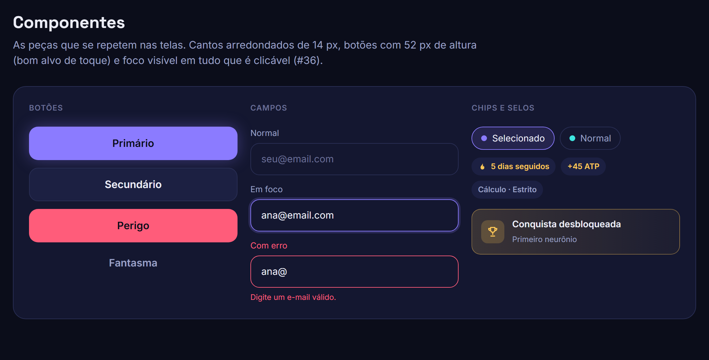

Cantos arredondados de 14 px, botões com 52 px de altura (bom alvo de toque) e foco visível em tudo que é clicável (#36).

## Para o grupo decidir

O protótipo assume algumas respostas para pontos que as issues deixam em aberto:

- **Cor do neurônio:** usa a cor da *matéria*, e o *tipo* muda só a forma. Sem matéria, usa o violeta da marca.
- **Modo padrão (#11):** o seletor Estrito/Tolerante fica na tela de foco e lembra a última escolha, sem precisar de tela de perfil.
- **Abas:** Foco, Rede, Histórico, Estatísticas e Mais.
- **Loja de ATP (#34):** ainda sem tela. A sugestão é que os tipos comprados sejam variações de cor ou de brilho, mantendo a forma ligada à duração.

## Referências visuais

- Desenhos de neurônios de Santiago Ramón y Cajal, que inspiraram as três formas: [Wikimedia Commons](https://commons.wikimedia.org/wiki/Category:Santiago_Ram%C3%B3n_y_Cajal_drawings)
- Microscopia de fluorescência: estruturas que acendem em cores sobre fundo preto.
- Forest: o fluxo foco → crescimento → recompensa, e a árvore morta que aqui vira a poda.
- Grafos com simulação de forças, base da rede interativa da #26: [d3-force](https://d3js.org/d3-force)

## Atualizar as imagens

Os PNGs são capturas do próprio `prototipo.html`. Cada tela pode ser aberta sozinha com `?so=`, por exemplo `prototipo.html?so=tela-rede`. Depois de mudar o protótipo, gere de novo com o Edge ou o Chrome (exemplo no Git Bash, a partir da raiz do repositório):

```bash
"/c/Program Files (x86)/Microsoft/Edge/Application/msedge.exe" --headless=new --hide-scrollbars --force-device-scale-factor=2 --virtual-time-budget=4000 --window-size=400,800 --screenshot="$(pwd -W)/docs/design/imagens/07-rede.png" "file:///$(pwd -W)/docs/design/prototipo.html?so=tela-rede"
```

Valores de `?so=`: `tela-login`, `tela-foco`, `tela-sessao`, `tela-desistir`, `tela-sucesso`, `tela-poda`, `tela-rede`, `tela-estatisticas`, `identidade`, `neuronios` e `componentes`.
